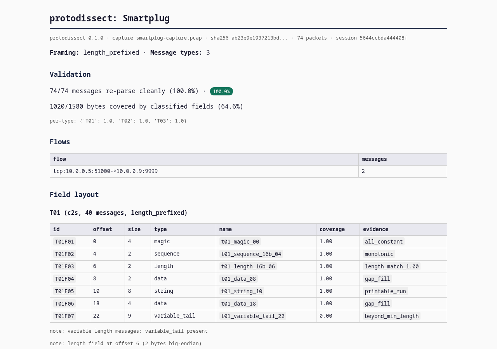
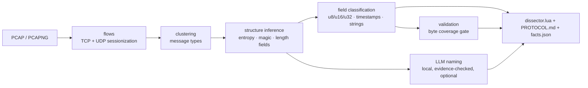

# protodissect

[](https://github.com/dilates/protodissect/actions/workflows/ci.yml)
[](LICENSE)

**Turn packet captures into Wireshark dissectors, automatically.**

protodissect is a protocol reverse engineering tool: point it at a PCAP or PCAPNG capture
of an unknown TCP or UDP protocol and it infers the message framing and field layout,
names the fields with an optional local LLM, and emits a working Lua dissector for
Wireshark plus clean protocol documentation. Deterministic, reproducible, and fully
offline by default. No cloud, no keys, no telemetry.

```text
$ protodissect demo --out out/

┏━━━━━━━━━━━━━━━━━━┳━━━━━━━━━┓
┃ metric           ┃ value   ┃
┡━━━━━━━━━━━━━━━━━━╇━━━━━━━━━┩
│ message types    │ 3       │
│ framing          │ length_prefixed │
│ messages parsed  │ 74/74   │
│ classified bytes │ 64.6%   │
│ LLM-named fields │ off     │
└──────────────────┴─────────┘
  wrote smartplug.lua   # drop into Wireshark plugins, done
  wrote PROTOCOL.md     # human-readable protocol specification
  wrote facts.json      # deterministic inference facts (CI-friendly)
  wrote report.html     # single-file annotated report
```

## Why protodissect

Hand-writing a Wireshark dissector for an undocumented protocol is slow, and existing
protocol reverse engineering tools stop at highlighting entropy. protodissect closes the
gap: it turns captures of unknown protocols into an executable Wireshark dissector and a
protocol specification you can hand to a developer or attach to a report.

| | protodissect | Manual Lua writing | Wireshark Decode-As |
|---|---|---|---|
| Works from a capture alone | **yes** | needs the spec | needs the spec |
| Field layout inference | **deterministic** | manual | none |
| Length-framing detection | **automatic** | manual | manual |
| Field naming help | **local LLM, evidence-checked** | you | none |
| Output you can ship | **Lua dissector + spec + facts** | Lua | nothing |
| Offline / air-gapped | **default** | yes | yes |
| Reproducible for CI | **byte-identical facts** | no | no |



## How it works



The core design rule is **facts before naming**: field layout inference is fully
deterministic and is the source of truth. The LLM only proposes names for fields the
inference engine already proved to exist, every name is evidence-checked against the
capture, and unvalidated names are dropped. Runs are byte-reproducible.

## Quickstart

```bash
pipx install protodissect

# try it on a bundled synthetic protocol, no capture needed:
protodissect demo --out out/

# real capture: dissect a TCP service on port 9999
protodissect infer capture.pcap --port 9999 --protocol-name smartplug

# add local LLM field naming (Ollama):
protodissect infer capture.pcap --port 9999 --llm ollama --llm-model llama3.1:8b
```

Drop the generated `smartplug.lua` into your Wireshark plugins folder and the protocol
appears in Wireshark immediately. Everything runs locally; remote OpenAI-compatible
endpoints are opt-in via `--llm-url`.

## What you get

- **`<name>.lua`** - a working Wireshark dissector (TCP and UDP, length-prefixed,
  fixed-size, and delimiter framing)
- **`PROTOCOL.md`** - a clean protocol specification with field tables and hex samples
- **`facts.json`** - deterministic inference facts, byte-reproducible, CI-friendly
- **`report.html`** - single-file offline report with coverage, evidence, and hex views

## Install

| Method | Command | Notes |
|---|---|---|
| pip / pipx | `pipx install protodissect` | recommended |
| from source | `uv sync && uv run protodissect --help` | see [CONTRIBUTING](CONTRIBUTING.md) |

Requirements: Python 3.11+. The optional local LLM field naming needs
[Ollama](https://ollama.com) or any OpenAI-compatible endpoint.

## FAQ

**Does my capture leave my machine?** No. Everything runs locally by default. Using a
remote LLM endpoint is an explicit opt-in flag, and reports say so when you do.

**Which captures work best?** A few hundred messages of a binary TCP or UDP protocol
with stable framing: IoT device protocols, game servers, telemetry, industrial protocols.
Encrypted traffic (TLS) is detected and skipped with a note, not guessed at.

**Is the output really a working dissector?** Yes: generated Lua registers on your
chosen port, builds the protocol tree, and decodes the fields inference found. The
validation gate reports what percentage of captured bytes the structure explains.

**Is it deterministic?** The inference pipeline is: same capture in, byte-identical
`facts.json` out. That makes it safe to gate CI pipelines on protocol regressions.

## Documentation

| Doc | What is in it |
|---|---|
| [Product spec](docs/PRODUCT_SPEC.md) | users, scope, success metrics |
| [Architecture](docs/ARCHITECTURE.md) | components, data model, process model |
| [Pipeline spec](docs/design/pipeline-spec.md) | framing, field inference, clustering |
| [ADRs](docs/adr/) | recorded design decisions |
| [Threat model](docs/THREAT_MODEL.md) | untrusted capture posture, LLM guardrails |
| [Getting started](docs/guides/getting-started.md) | walkthrough with real output |

## Contributing

Specs first, ADRs for decisions, capture-driven tests. Start with
[CONTRIBUTING.md](CONTRIBUTING.md). Found a vulnerability in protodissect itself? See
[SECURITY.md](SECURITY.md).

## License

BSD-3-Clause - see [LICENSE](LICENSE).
 