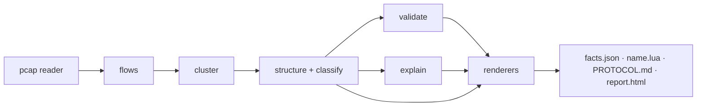

# Architecture

| | |
|---|---|
| **Status** | Approved for M1-M4 |
| **Owner** | Architecture |
| **Last updated** | 2026-09-30 |

## 1. Design principles

1. **Facts before naming.** Field layout inference is deterministic and is the source of
   truth. The LLM only proposes names for fields inference already proved, must cite
   evidence, and unvalidated names are dropped. (ADR-0003)
2. **Local-first, offline-capable.** Captures are sensitive. Every stage completes with
   no network. (ADR-0004)
3. **Reproducible or it did not happen.** Same capture + same versions produces a
   byte-identical facts.json. Enforced in CI.
4. **Untrusted input is capped.** Captures are hostile files: parser bugs and
   decompression-style bombs are real. Resource caps everywhere. (THREAT_MODEL)
5. **Zero-ops.** SQLite + on-disk blobs, no server, no daemon. (ADR-0008)
6. **Evidence everywhere.** Every inferred field links to concrete evidence: offsets,
   value samples across messages, and the rule that fired.

## 2. Component overview

| Component | Role | Notes |
|---|---|---|
| `proto_dissect.cli` | Entrypoint, orchestration | typer, the only user surface |
| `proto_dissect.pcap` | PCAP + PCAPNG readers with caps | own parser, zero deps (ADR-0002) |
| `proto_dissect.flows` | Link/IP/TCP/UDP decode, sessionization, naive TCP reassembly | |
| `proto_dissect.cluster` | Message type clustering (length buckets + simhash) | ADR-0006 |
| `proto_dissect.structure` | Framing detection + field boundary inference | the deterministic core |
| `proto_dissect.classify` | Field type classification (length, magic, timestamp, seq, string, data) | |
| `proto_dissect.validate` | Round-trip byte coverage + gate | |
| `proto_dissect.explain` | LLM field naming, evidence-validated, optional | ADR-0003/0004 |
| `proto_dissect.dissector` | Lua Wireshark dissector generation | ADR-0005 |
| `proto_dissect.spec` | PROTOCOL.md generation | |
| `proto_dissect.report` | facts.json / Markdown / single-file HTML renderers | |
| `proto_dissect.store` | SQLite sessions + content-addressed blobs | ADR-0008 |



## 3. Core data model

### 3.1 Flow and Message

```jsonc
{
  "flow": {"proto": "tcp", "client": "10.0.0.5:51000", "server": "10.0.0.9:9999"},
  "messages": [
    {"id": "M0001", "dir": "c2s", "ts": 1727300000.1, "len": 24,
     "payload_hex": "50 4c 01 00 ...", "tcp_seq": 1001}
  ]
}
```

### 3.2 MessageType (cluster)

```jsonc
{
  "id": "T01", "dir": "c2s", "count": 143,
  "framing": {"kind": "length_prefixed", "field": "F0002"},
  "fields": [
    {"id": "F0001", "offset": 0, "size": 2, "type": "magic",
     "value_hex": "504c", "coverage": 1.0},
    {"id": "F0002", "offset": 6, "size": 2, "type": "length",
     "endian": "big", "covers": "rest", "coverage": 1.0},
    {"id": "F0003", "offset": 8, "size": 2, "type": "sequence",
     "endian": "big", "coverage": 1.0}
  ],
  "variable_tail": {"offset": 20, "coverage": 0.94}
}
```

### 3.3 FactsDoc (facts.json, schema v1)

Top-level: `schema_version`, `tool`, `capture` (sha256, format, linktype, caps applied),
`flows` summary, `message_types[]`, `validation` (per-type coverage + total),
`naming` (LLM section, provenance + per-field evidence, absent when off), `config`.
Byte-reproducible via sorted-key JSON. Full schema: design/report-format.md.

## 4. Process model

Single Python process, no workers needed: parsing and inference are CPU-bound and
fast (10k packets in seconds). Memory caps bound hostile captures. Deterministic mode
derives session ids from content hashes and omits timestamps.

## 5. Storage layout

```
~/.cache/protodissect/
├── objects/<sha256[:2]>/<sha256>     # captures, facts, reports (content-addressed)
└── sessions/<id>/session.db          # SQLite: sessions + artifact index
```

## 6. Extension points (v0.2+)

| Extension | Mechanism |
|---|---|
| Custom field classifiers | `proto_dissect.classifiers` entrypoint group |
| Output formats | `proto_dissect.renderers` entrypoint group (Kaitai candidate) |
| LLM providers | `proto_dissect.llm` entrypoint group |

## 7. Performance budget

Tracked in CI: 10k packets / 500 messages end-to-end under 10s on 8 cores; memory
under 1 GB for a 100 MB capture (caps enforce).

## 8. Failure modes

| Failure | Behavior |
|---|---|
| Malformed pcap block | skip with note; session records parse errors; never fatal unless zero packets |
| No flows on the requested port | precise error, exit 2, hints `--port` |
| Framing undetectable | framing "unknown" + honest note; dissector still emitted for fixed-length types |
| Coverage below gate | `validate` exits 1 with per-type breakdown |
| LLM provider down | naming section omitted, everything else identical |

## 9. Security architecture summary

Pure-Python parsers (no native code), hard caps on capture size and packet count,
packet bytes treated as data (not instructions) at the LLM boundary, no network by
default. Full analysis: THREAT_MODEL.md.
